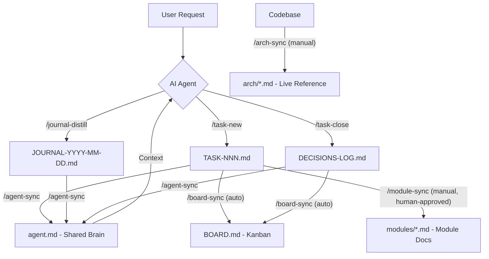

# AI Docs 🚀

> **AI-driven documentation workflow automation.**

`AI Docs` is a Markdown-based framework that keeps your development process structured and searchable, with a special focus on collaborative work with AI agents (e.g., Antigravity, Claude Code, OpenCode).


[](https://github.com/GoogleCloudPlatform/knowledge-catalog/blob/main/okf/SPEC.md)

Since v0.2 of this template, `_docs/` is also an [Open Knowledge Format](https://github.com/GoogleCloudPlatform/knowledge-catalog/blob/main/okf/SPEC.md)-conformant knowledge bundle: `type`-tagged concepts, `index.md`/`log.md` reserved files, and plain markdown cross-links instead of Obsidian wikilinks — so any generic OKF consumer (not just Obsidian) can read it without translation.

---

## ✨ Key Features

- 🤖 **Automated Workflows**: TASK, JOURNAL, and ADR-based documentation management via `/` commands.
- 🧠 **Shared Brain (`agent.md`)**: Provides a consistent and fresh context for all AI agents.
- 📋 **Plaintext Kanban (`BOARD.md`)**: Auto-generated task board with per-task subtask progress — no external tool needed.
- 🏗️ **Live Architecture Reference (`arch/`)**: Stack, directory map, entry points, DB schema, config/env, and integrations, regenerated from the actual codebase via `/arch-sync`.
- 🧩 **Module Docs (`modules/`)**: Durable, per-module reference files (responsibility, dependencies, invariants) kept current via a manual, human-approved delta sync.
- 💎 **Modern Aesthetics**: Structured Markdown format readable everywhere.
- 📂 **Obsidian Compatibility**: The `_docs/` folder works immediately as an Obsidian vault (with Dataview support).
- 🛠️ **Customizable**: Easily expandable using Antigravity Workflows and Skills.

---

## 🛠️ How it Works

The system documents every step of the development cycle so knowledge is not lost between chat sessions.



---

## 📂 Folder Structure

```
project-root/
├── agent.md                  ← Shared Brain (generated by /agent-sync)
├── README.md
├── CHANGELOG.md
├── LICENSE
├── .agents/
│   ├── workflows/            ← /command workflow definitions
│   ├── skills/               ← Reusable agent skills
│   |   └── documentation/
│   |       └── SKILL.md      ← Documentation skills
│   └── rules/                ← Rules for the agent
│       └── style-guide.md    ← Style guide and conventions
└── _docs/
    ├── README.md             ← Detailed documentation guide
    ├── index.md              ← [OKF] bundle root index (reserved filename)
    ├── log.md                ← [OKF] chronological history (reserved filename)
    ├── BOARD.md              ← [GENERATED] plaintext kanban view of all tasks (via /board-sync)
    ├── DECISIONS-LOG.md      ← ADR log (generated/updated by /task-close)
    ├── PROJECT-OVERVIEW.md   ← Project map (generated by /project-sync)
    ├── tasks/                ← TASK-NNN_name.md files (+ index.md)
    ├── journal/               ← JOURNAL-YYYY-MM-DD-topic.md files (+ index.md)
    ├── modules/               ← [MANUAL] durable per-module reference docs (via /module-sync) (+ index.md)
    ├── arch/                  ← [GENERATED] stack, directory map, entry points, DB schema, config/env, integrations (via /arch-sync)
    ├── spec/                  ← Business specs, user stories
    └── _templates/            ← Templates for all document types (TASK, JOURNAL, MODULE, BOARD, PROJECT-OVERVIEW, DECISIONS-LOG, plus the arch/* templates)
```

---

## 🚀 Quick Start

### 1. Requirements

An **agentic AI development environment** is required to run the workflows — such as:
- [Antigravity](https://antigravity.dev)
- [Claude Code](https://claude.ai/code)
- [OpenCode](https://opencode.ai)

These tools can read `.agents/workflows/` and execute `/` commands directly in the chat.

### 2. Clone or download the repo

```bash
git clone https://github.com/dynamicart/ai-docs.git my-project
cd my-project
```

### 3. Initialize the Shared Brain

On first use, there is no `agent.md` yet. Generate it with your agent:

```
/agent-sync
```

This reads all files in `_docs/` and creates `agent.md` in the project root. From this point on, every agent session starts with fresh, up-to-date context.

### 4. Bootstrap the architecture reference (recommended for existing codebases)

```
/arch-sync
```

On first run this scans the actual codebase and fills in `_docs/arch/*.md` (stack, directory map, entry points, DB schema, config/env, integrations). Re-run any time the codebase structure changes meaningfully.

### 5. Start your first task

```
/task-new title="Project initialization"
```

The task automatically appears on `_docs/BOARD.md`.

---

## ⚡ Workflow Commands

All workflows live in `.agents/workflows/`. Supported commands:

| Command | Description | Trigger |
|---|---|---|
| `/agent-sync` | Update the `agent.md` file. | manual |
| `/task-new [title]` | Creates a new `TASK-NNN_name.md` file from the template. | manual |
| `/task-new from-journal` | Creates a new TASK based on a closed JOURNAL entry. | manual |
| `/task-close [TASK-NNN]` | Closes the task, updates status, records decisions into `DECISIONS-LOG.md`. | manual |
| `/task-close with-journal [TASK-NNN]` | Closes the task AND distills a final journal entry. | manual |
| `/journal-distill` | Saves the essence of the current chat session into a structured JOURNAL file. | manual |
| `/project-sync` | Regenerates `_docs/PROJECT-OVERVIEW.md` with the current project state. | manual |
| `/arch-sync [target]` | Regenerates the `arch/*.md` live-reference files from the codebase. | manual |
| `/module-sync <module-name> [TASK-NNN]` | Proposes a human-approved delta update to a single `modules/*.md` file — never auto-runs. | manual only |
| `/board-sync` | Fully rebuilds `_docs/BOARD.md`, the plaintext kanban view of all tasks. Pure read+render, no approval gate. | **auto** (end of `/task-new`, `/task-close`) + manual |

### Typical daily workflow

```
# Begin new work
/task-new title="Add user authentication"
# → BOARD.md updates automatically

# ... planning happens ...

# Save important decisions from the chat
/journal-distill

# ... development happens ...
# check off items in the TASK's "Approach / Plan" checklist as you go

# Finish the task
/task-close with-journal TASK-001
# → BOARD.md updates automatically

# Update the Shared Brain for next time
/agent-sync

# Update the project map for next time if necessary
/project-sync

# Keep the architecture reference current after structural changes
/arch-sync

# Update a specific module's docs after a task that touched it (human-approved)
/module-sync billing TASK-001
```

---

## 📄 License

This project is available under the **MIT License**. See the [LICENSE](LICENSE) file for details.

---
